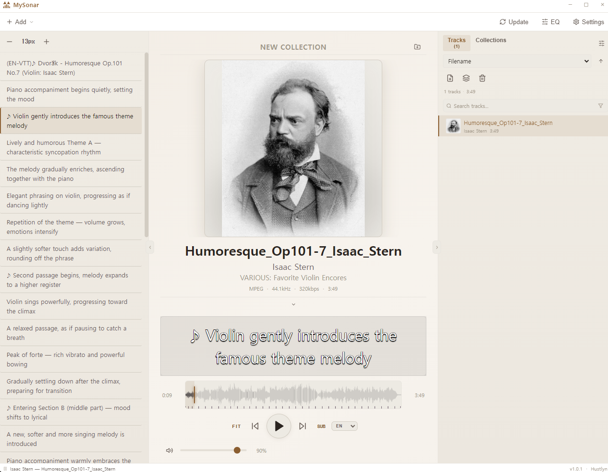

# MySonar

リアルタイム字幕対応のデスクトップ音楽プレイヤー。
**Windows · macOS** — v1.0.1 · リリース日 2026. 02. 22 · 開発 Hustlyn

[English](README.md) · [한국어](README.ko.md)

---



---

## 対応フォーマット

| 種類 | フォーマット |
|---|---|
| オーディオ | WAV · FLAC · MP3 · OGG · OPUS · AAC · M4A · AIFF · WebM |
| 字幕 | SRT · VTT · ASS / SSA · SMI · LRC · TXT |

---

## 字幕ファイルの命名ルール

字幕ファイルはオーディオファイルと同じフォルダに置くと自動的に認識されます。

### RAW（言語なし）

| パターン | 例（オーディオ: `rain.flac`） |
|---|---|
| `<ファイル名>.<字幕拡張子>` | `rain.srt` |
| `<ファイル名>.<オーディオ拡張子>.<字幕拡張子>` | `rain.flac.srt` |

RAW 字幕は字幕セレクターに **RAW** と表示されます。

### 言語コード付き

| パターン | 例（オーディオ: `rain.flac`） |
|---|---|
| `<ファイル名>.<言語>.<字幕拡張子>` | `rain.en.srt` · `rain.ja.vtt` |
| `<ファイル名>.<オーディオ拡張子>.<言語>.<字幕拡張子>` | `rain.flac.ko.srt` |

`<言語>` は小文字 2〜3 文字の ISO 639-1 コードを使用してください（例: `en`, `ko`, `ja`, `fra`）。

**例 — `rain.flac` のフォルダ構成:**

```
rain.flac
rain.srt            ← RAW
rain.en.srt         ← 英語
rain.ja.vtt         ← 日本語（別フォーマット）
rain.ko.ass         ← 韓国語
rain.flac.zh.srt    ← 中国語（フルファイル名形式）
```

1つのトラックに複数の言語とフォーマットを同時に使用できます。同じ言語に複数の字幕ファイルがある場合、言語セレクターの隣にフォーマットセレクター（SRT / VTT / …）が表示されます。

---

## 機能

### 再生
- リアルタイムアナライザーを重ねた波形シークバー
- トラック間クロスフェード（時間調整可能）
- ファイルごとに最後の再生位置を記憶

### オーディオ処理
- 10バンドイコライザー（32 Hz – 16 kHz）— シンプル / プロモード、プリセット内蔵
- ダイナミクスコンプレッサーおよびベースブースト
- 音量ノーマライゼーション（ReplayGain）(BETA)
- 空間オーディオ — HRTF バイノーラルポジショニング（X / Y / Z 軸）
- モノラルテストトーンを使った左右の聴力バランス補正

### 字幕
- オーバーレイ表示 — フォント・サイズ・色・アウトライン・影・位置を調整可能
- 現在のキューをハイライト表示し自動スクロールするスクリプトパネル
- インラインカラータグのレンダリング（SRT / VTT / SMI）
- 前後の字幕キューへのジャンプ

### プレイリストとコレクション
- ファイルやフォルダをウィンドウのどこにでもドラッグ＆ドロップ
- 複数選択：Ctrl+クリック · Shift+クリック · マウスドラッグ
- プレイリスト内の折りたたみ可能なトラックグループ、ドラッグで並び替え可能
- 名前・再生時間・ファイルサイズで並び替え（自然数順）
- コレクション — `.msc` ファイルとして保存される名前付きプレイリスト
  - コレクションごとに複数のカバー画像、ドラッグで並び替え可能
  - 評価（0〜5 星）およびカスタムタグ
  - 1 ページあたりのトラック数：5 / 10 / 20
- タグフィルターと最低評価フィルターを使った検索
- 全メタデータを確認できるトラック情報モーダル

### 外観
- 7 種類のテーマ：Dark · Light · Dark Rose · Light Rose · Light Marine · Dark Marine · Pink
- 角丸の透過ウィンドウ
- アルバムアート：埋め込みメタデータ・同名画像ファイル・ドラッグ＆ドロップで上書き
- キー操作時に画面に表示されるアクションオーバーレイ
- ステータスバー — リアルタイム再生情報

---

## キーボードショートカット

| キー | 動作 |
|---|---|
| `Space` | 再生 / 一時停止 |
| `←` / `→` | シーク ±1 秒 |
| `Shift` + `←` / `→` | シーク ±5 秒 |
| `Ctrl` + `←` / `→` | シーク ±0.2 秒 |
| `↑` / `↓` | 音量 ±5% |
| `Z` / `X` | 前 / 次の字幕行 |
| `Alt` + `←` / `→` | 前 / 次の字幕キューへジャンプ |
| `[` / `]` | 字幕フォントサイズ −1 / +1 px |

`Ctrl+A`（全選択）を除くすべてのショートカットは **設定 → コントロール** で変更できます。
シーク量（±1 秒 / ±5 秒 / ±0.2 秒）もカテゴリごとに調整できます。

---

## 多言語対応

標準搭載：**英語 · 韓国語 · 日本語**

他の言語を追加するには、以下のフォルダに `.json` ロケールファイルを置いてください：

```
<実行ファイルのフォルダ>/locales/<言語コード>.json
```

同じ言語コードのファイルがある場合、ユーザーファイルが標準ファイルより優先されます。
